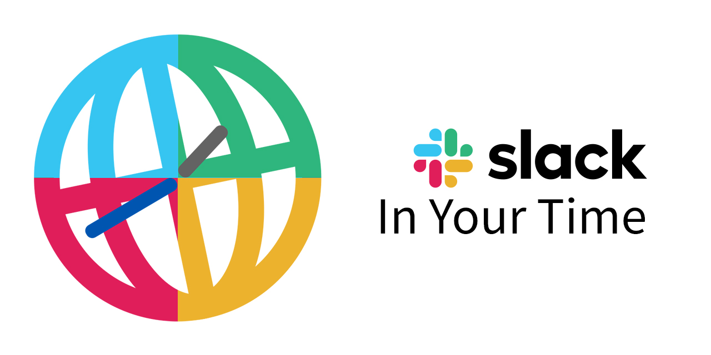

# Slack In Your Time

> This app is still under development.
> Expect a lot of changes to happen before it's published to Slack.

## Introduction

Are you part of a multi-national team who only works across the internet?
Or are you the British Empire and your sun is never setting?

Either way, if you have worked in a team with more than two timezones, you've definitely had a situation where someone wanted to have a meeting with you at 5, but you misunderstood when 5 actually was on your area!
As more and more people work through the internet with strangers from across the globe, this will be a common issue.
Until everyone is used to using Unix epoch time, we'll have to do something about it.

That is why we decided to make this Slack app.

## Feature

This application is powered by the wonderful library for NLP date parsing that is [chrono](https://github.com/wanasit/chrono) and [bolt-js](https://github.com/SlackAPI/bolt-js).

Once you install this app to your Slack channel, it will listen to all text messages that references time.
If your channel member has more than one timezones, this app will ask you if you would like to convert the time from your local timezone to all the member's timezone.

Right now this is done automatically for everyone, but we are planning on adding configurable behaviors like the ability to choose between public messages or messages only visible to the respective members.
